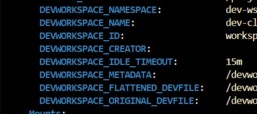

# DevCli

The goal of this project is to provide a cli to hasten my dev process and to create interface for the tools I use.

## Eclipse Che

Eclipse che is my main env that allow me to dev in my personal time (and i love it). This project is born from [this issue](https://github.com/eclipse/che/issues/22812) that follow my thinking process of loving project with source openly available.

There is also a redhat release of che that is called [DevSpace](https://developers.redhat.com/products/openshift-dev-spaces/overview).

### Commands

Inside of this module there will be multiple categories of commands that will be available, like:

- `dev_cli code` - Commands that are related to vscode manipulation (Open che workspace in vscode desktop)
- `dev_cli workspace` - Commands that are related to workspace manipulation (Info/Get/List/Start/Stop/...)
- `dev_cli shell` - Commands that are related to shell manipulation (ItShell/ExecShell/...)
- `dev_cli completion` - Commands that are related to completion manipulation (Bash/Zsh/...)
- `dev_cli devfile` - Commands that are related to devfile manipulation (Create/Update/...)
- `dev_cli dockerfile` - Commands that are related to dockerfile generation (Based on template/...)

#### Code - Working

- `dev_cli code open` - Open the current workspace in vscode desktop
- `dev_cli code check` - Check if the needed vscode extension are installed and install them if needed

#### Workspace - Missing restart from local

- `dev_cli workspace get` - Output workspace info, and if run directly in a workspace, output the current workspace info, either ask the user to choose a workspace (output could be json or yaml)
- `dev_cli workspace get_container` - Get a workspace's container by name, by default the current if in one
- `dev_cli workspace list` - List all the workspaces
- `dev_cli workspace start` - Start a workspace by name
- `dev_cli workspace stop` - Stop a workspace by name
- `dev_cli workspace restart` - Restart a workspace by name
- `dev_cli workspace restart_from_local` - Restart from local devfile

#### Shell - Working

- `dev_cli shell` - Start an interactive shell in the current workspace

#### Completion - Working

- `dev_cli completion -s $TERMINAL_KIND` - Output $TERMINAL_KIND completion script

## MonoRepo

Based on the [Rust NX](https://github.com/cammisuli/monodon/tree/main/packages/rust) template.

```bash
nx generate @monodon/rust:library my-rust-lib # Create lib
nx generate @monodon/rust:binary my-rust-app # Create app
```

## Developing

### NotaBene

- To detect DevSpace/Eclipse Che there is some env var that's available.
  
- You can start/stop with a simple patch [Code Source](https://github.com/che-incubator/che-code/blob/6e0a908d58cacb380c216dde3af544d75e3913d5/code/extensions/che-api/src/impl/k8s-workspace-service-impl.ts#L62)

### CRD handling and generating

You can get the CRD def with `kubectl explain devworkspace` for exemple, the `src/crd` include the Modop to generate new CRD or update existing one based based on the neeeded crd.

### Restart from local Devfile

Has of now the restart in VsCode is not fit for other ide [(How it's done in che-code)](https://github.com/che-incubator/che-code/blob/main/code/extensions/che-remote/src/extension.ts#L75). This way of working need to be tweaked for Idea and futur other ide. To make it easier i found the annotation "che.eclipse.org/che-editor" in the DevWorkspace CRD that include the editor passed on startup (Could be interesting to include the one in .che/che-editor if the other one is not found)

### Dockerfile/DevFile templating

Long story short i would like to include in another submodule/cli close to this one (it's possible that in the futur i pop out this part) a module that would act has a component library who would output a Dockerfile including all your need. Atm i have made the batleforc/che-base that include the base tool that i deemed necessary and made some variant based on it including different tool (sdkman for a full java image, Rust and cargo for a rust variant, etc). BUT i may need in some case to reduce the size of those image (ATM less than 1Go).

### Prerequisites

- [Rust](https://www.rust-lang.org/tools/install)
- [Cocogitto](https://github.com/cocogitto/cocogitto)
- [Nx](https://nx.dev/latest/node/getting-started/installation)
- [Cargo Workspace](https://crates.io/crates/cargo-workspaces#usage)
- [GitLeaks](https://github.com/gitleaks/gitleaks)

Please do `cog install-hook --all` before your first commit, the hooks include a pre commit that will check for any secret and possible clippy error.

## CICD ?

This repo has two CICD:

- Build and Release that will create a release draft on each Tag
- Clippy that will check for possible improvement

### Release

NO TAG SHOULD BE MANUALY MADE !!

To make a tag use :

```shell
cog bump [ --patch | --minor | --major ]
```

Doing it with the cli will:

- Increment the past version depending on the choice made (path/minor/major)
- Change the version in Cargo.toml
- Generate the changelog
- Trigger the pipeline that will create a draft with possible package

#### If you want to undraft the release

- Go to the [Github release page](https://github.com/batleforc/Dev-cli/releases)
- Select the release to undraft
- Give it a name like `0.2.2 - Dalek` and a descrption to your need
- Publish the release and enjoy !!
